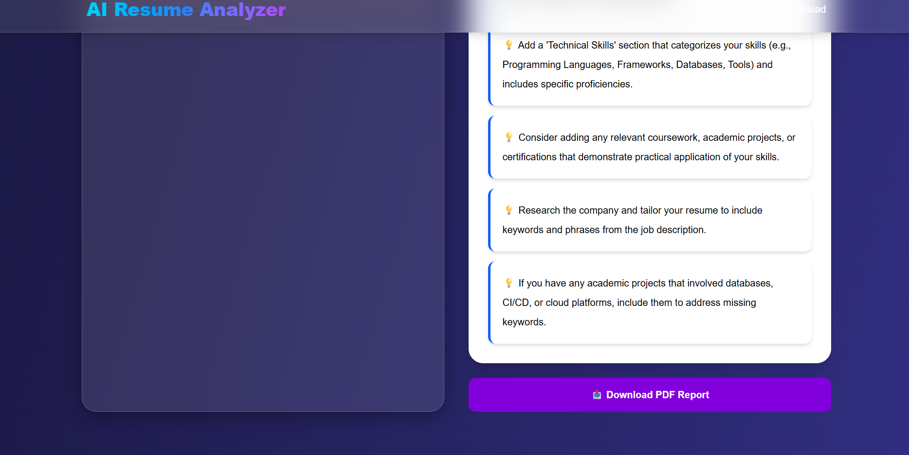

<div align="center">

# 📄 AI Resume Analyzer

### AI-Powered ATS Score & Keyword Match Analysis Platform

AI Resume Analyzer is a full-stack web application that evaluates how well a resume matches a job description, returning an ATS-style compatibility score and a keyword-level gap analysis powered by the OpenRouter API (Google Gemini 2.5 Flash).

🌐 **Live Application:** https://ai-resume-analyzer-z1q5.vercel.app/

</div>

---

## 🚀 Features

### 📄 Resume & Job Description Input
- PDF resume upload
- Plain-text job description paste
- Instant, on-demand analysis with no sign-up required

### 🔍 ATS Compatibility Scoring
- Overall ATS-style compatibility score
- Resume-to-job-description alignment assessment
- Semantic matching, not just exact-keyword matching

### 🤖 AI Keyword & Skill Gap Analysis
AI Resume Analyzer uses the Anthropic Claude API to read both documents and provide:

- Keywords and skills present in the resume
- Keywords and skills missing from the resume
- Semantic relevance assessment (catches relevant experience phrased differently)
- Actionable, resume-specific feedback

The analysis is powered through the **Anthropic Claude API**.

### ⚡ Instant Results
- Analysis runs in seconds after submission
- No account, subscription, or payment required
- Server-side processing keeps the Claude API key off the client

---
## 📸 Application Preview

### 🏠 Dashboard

<p align="center">
  
</p>

---

### 📄 Resume Upload

<p align="center">
  
  
</p>

---

### 🤖 AI Analysis

<p align="center">
  
</p>

---

### 💡 AI Suggestions

<p align="center">
  
  
</p>

---


## 🏗️ Architecture

```text
                    ┌─────────────────────┐
                    │       User          │
                    └──────────┬──────────┘
                               │
                               ▼
                    ┌─────────────────────┐
                    │   Next.js Frontend  │
                    │      (Vercel)       │
                    └──────────┬──────────┘
                               │ 
                    Server-side API Route
                               ▼
                    ┌─────────────────────┐
                    │  Next.js API Route  │
                    │  (PDF text extract) │
                    └──────────┬──────────┘
                               │
                               ▼
                    ┌─────────────────────┐
                    │    OpenRouter API   │
                    └─────────────────────┘
  ```
---

## 🛠️ Tech Stack

### Frontend
- Next.js
- React
- TypeScript
- Geist (via `next/font`)

### Backend
- Next.js API Routes (server-side)
- PDF text extraction

### AI Integration

- OpenRouter API
- Google Gemini 2.5 Flash

### Deployment
- Vercel — Frontend & API Routes

### Development & Version Control
- Git
- GitHub
- VS Code

---

## 📡 API Endpoints

| Endpoint | Method | Description |
|---|---|---|
| `/` | GET | Application home page |
| `/api/analyze` | POST | Accepts a resume (PDF) and job description, returns ATS score and keyword analysis |

---

## 📊 Analysis Output

AI Resume Analyzer returns:

- ATS compatibility score
- Matched keywords/skills
- Missing keywords/skills
- Overall alignment summary

---

## 🤖 AI Analysis Workflow

```text
Resume (PDF) + Job Description
      ↓
Next.js API Route
      ↓
PDF Text Extraction
      ↓
Anthropic Claude API
      ↓
Semantic Comparison & Scoring
      ↓
ATS Score + Keyword Match/Gap Breakdown
      ↓
Next.js Frontend
```

---

## 💻 Running Locally

### 1. Clone the Repository

```bash
git clone <your-repo-url>
cd ai-resume-analyzer
```

### 2. Install Dependencies

```bash
npm install
```

### 3. Configure Environment Variables

Create a `.env.local` file:

```env
ANTHROPIC_API_KEY=your_anthropic_api_key
```

### 4. Run the Development Server

```bash
npm run dev
# or
yarn dev
# or
pnpm dev
# or
bun dev
```

Open:

```text
http://localhost:3000
```

Or visit the live application:

**https://ai-resume-analyzer-z1q5.vercel.app/**


You can start editing the page by modifying `app/page.tsx`. The page auto-updates as you edit the file.

---

## 🌐 Deployment

The application is deployed as a single Next.js project on Vercel, with the API route running server-side alongside the frontend.

Production:
https://ai-resume-analyzer-z1q5.vercel.app/

---

## 🔐 Environment Variables

The following environment variable is required:

```env
openrouter_API_KEY=your_openroutr_api_key
```

> Never commit API keys or `.env.local` files to GitHub.

---

## 📂 Project Structure

```text
ai-resume-analyzer/
│
├── app/
│   ├── page.tsx
│   ├── layout.tsx
│   ├── globals.css
│   └── api/
│       └── analyze/
│           └── route.ts
│
├── public/
├── package.json
├── .env.local
└── README.md
```

---

## 🎯 Project Highlights

- Full-stack AI-powered resume analysis application
- PDF resume upload with server-side text extraction
- Semantic keyword and skill gap analysis via the Claude API
- Server-side API route keeps credentials secure
- Instant, no-signup analysis workflow
- Production deployment on Vercel

---

## 🔮 Future Improvements

- DOCX resume upload support
- Downloadable analysis report
- Section-by-section resume feedback (summary, experience, skills)
- Resume history / saved analyses
- Support for multiple AI providers
- Tailored bullet-point rewrite suggestions

---

## 👨‍💻 Author

**Abhinav**

Computer Science & Engineering  
Interested in AI, Generative AI, Full-Stack Development and Intelligent Automation.

---

## ⭐ Support

If you find this project useful, consider giving the repository a ⭐.
